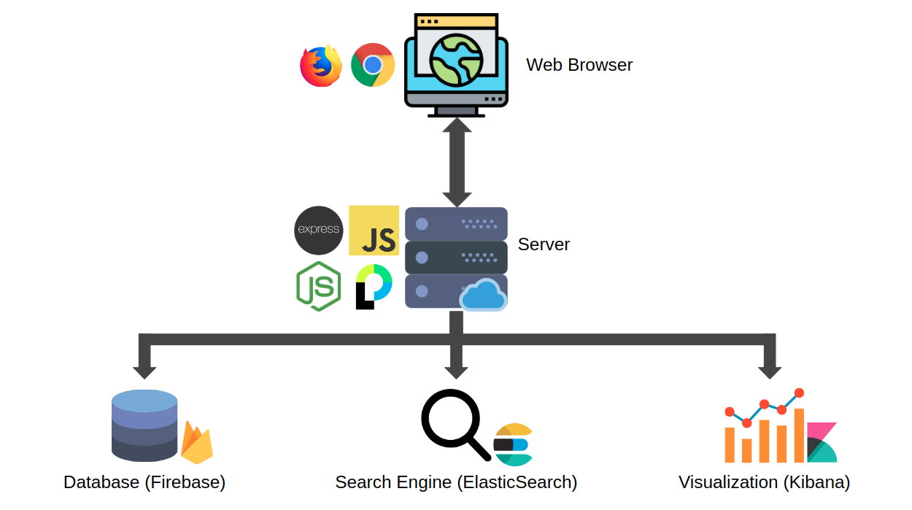

# Libellus

A web application to store details about publications, conference, books, patents, etc of professors in an institution. This information stored in firebase is mirrored and indexed in elasticsearch to support search engine capabilities.

  

A modified version of [google's flashlight plugin](https://github.com/googlearchive/flashlight) is used to sync data between firebase and elasticsearch. This modified plugin is maintained in [a separate repository](https://github.com/parinithshekar/flashlight).

